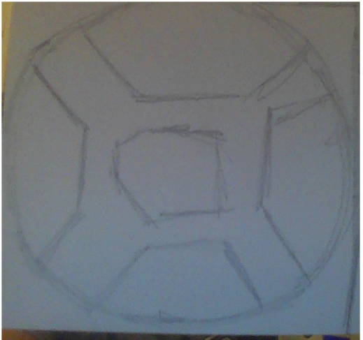
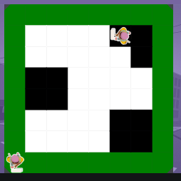

# Unit 1 - Asphalt Art

## Introduction

Cities use asphalt art to improve public safety, inspire their residents and visitors, and brighten communities. Your goal is to create asphalt art to revitalize The Neighborhood and bring the community together with the help of the Painter.

## Requirements

Use your knowledge of object-oriented programming, algorithms, the problem solving process, and decomposition strategies to create asphalt art:
- **Create a new subclass** – Create at least one new subclass of the PainterPlus class that is used for a component of the asphalt art design.
- **Plan an algorithm** – Use the problem solving process and decomposition strategies to plan an algorithm that incorporates a combination of sequencing, selection, and/or iteration.
- **Write a method** – Write at least one method in a PainterPlus subclass that contributes to a component of the asphalt art design.
- **Document your code** – Use comments to explain the purpose of the methods and code segments.

## Notes: Neighborhood & Painter Class

This project was created on Code.org's JavaLab platform using the built in Neightborhood GUI output. To test and edit this project you must build in Code.org's JavaLab with the Neighborhood GUI enabled. For reference to the Painter class documentation, [you can read more here.](https://studio.code.org/docs/ide/javalab/classes/Painter)

## Output:

 /
## Reflection

1. Describe your project.

I commnded two painters to paint a green background and  soccer ball in code.org. I used mural painter to make the green, and used another painter to paint the soccer ball and the details. 

2. What are two things about your project that you are proud of?

I am proud thtrt it painted the ball sucessfully. I struggled with instntiating two different painters and my code was not very efficient. I am proud that my hard work payed off. 

3. Describe something you would improve or do differently if you had an opportunity to change something about your project.

I would condense my code to make it more efficient and I would mke my future images more crisp looking. 